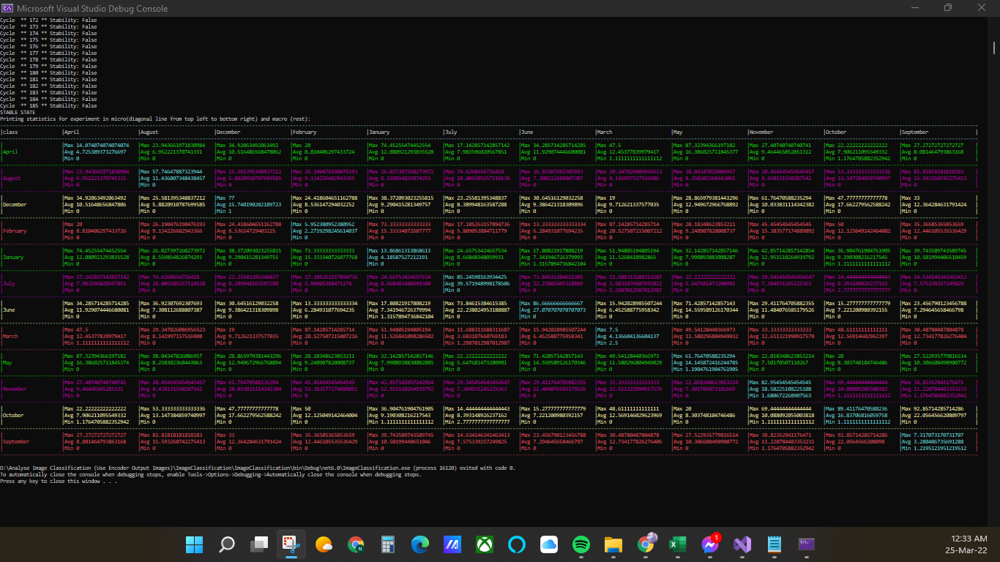

# Project Title
ML21/22-1.2.Analyse Image Classification (Use Encoder Output Images)
## Team Name
Acroaticus
## Project Directory Guide
* ./MyProject/ImageClassification
    This directory has our Final Project codes [Final Project Codes](https://github.com/Niloy-Sarker96/neocortexapi-classification/tree/Team_Acroaticus)
- ./Documentation
    This directory contains documents that include an MD, Docx, pdf, ppt, and mp4. (Remarks- Work in progress)
## Project Plan
We’re working on a project named “Analyse Image Classification (Use Encoder Output Images)”. Where we’ll use the user input data to generate DateTime encoder output image (BitMap Images). 

Firstly, the user will input the date & time for different months then the code will generate bitmap images for these inputs using the DateTime Encoder from Neocortexapi. Then our code will compare the min, max, & avg. value from the different bitmap images generated from input data. Here, we are giving some examples of how we used our input. 

For Example, **"01/01/2016 01:01:01"** our input will be like this. Then from this input DateTime encoder will create a bitmap image like given below.

After comparing different bitmap images like this, we’ll get a table of min. max, & avg. comparison value, like given below

Acknowledgments
----------------
1. Neocortexapi-classification
2.	NeoCortexApi
3.	FUAS-SE-Cloud-2021-2022 colleagues
